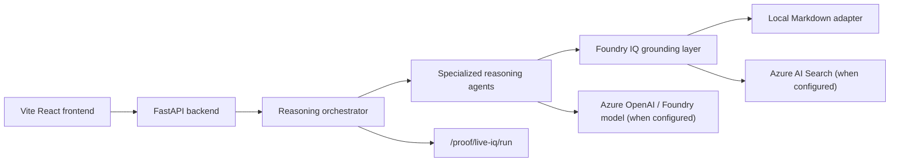

# FailureLens IQ

FailureLens IQ turns failed machine-learning experiments into evidence-grounded diagnosis, remediation plans, and Microsoft certification-aligned team learning.

## Microsoft Agents League Context

This repository is built for the Microsoft Agents League, Reasoning Agents Track. The submission demonstrates a multi-agent workflow that inspects failed ML experiment evidence, explains root cause and uncertainty, retrieves grounding, and produces manager-ready remediation output.

The project is intentionally honest about liveness:

- Local mode runs without credentials and uses a local Foundry IQ-compatible adapter.
- Azure mode can use Azure AI Search and Azure/Foundry model reasoning when environment variables are present.
- `live_microsoft_iq=true` is returned only after a run actually returns `source_type=azure_ai_search` grounding refs.

## What Problem It Solves

Failed ML experiments often disappear as isolated notebooks, bad metrics, or one-off incident notes. Teams lose the lesson, managers cannot see recurring skill gaps, and the same failure pattern returns later in production.

FailureLens IQ converts each failed run into reusable organizational memory:

- What failed?
- Why did it fail?
- Which evidence supports that diagnosis?
- What remains uncertain?
- What should the team do next?
- Which Microsoft learning path or certification skill area is implicated?

## Why It Matters

Enterprise AI teams need more than a classifier. They need reasoning traces, grounded evidence, confidence calibration, human-review gates, and honest proof of which live services were used. FailureLens IQ is structured around those audit needs.

## Key Features

- Prompt-to-experiment analysis from the React chat page.
- Multi-agent orchestration for intake, classification, root cause, historical memory, remediation, assessment, and manager synthesis.
- Local Foundry IQ-compatible knowledge retrieval for credential-free demos.
- Azure AI Search adapter for live grounding when configured.
- Azure/Foundry model reasoning support through environment-selected providers.
- Microsoft certification and learning-path mapping.
- Confidence and human-review gates.
- Live proof endpoint with trace IDs and copyable judge JSON.
- FastAPI backend, Vite React frontend, and CI-ready tests.

## Agent Workflow

1. Intake Agent validates the experiment packet and missing fields.
2. Planner builds the suspected failure hypothesis and execution plan.
3. Classifier Agent categorizes the failure pattern from metrics and notes.
4. RootCauseAnalyzerAgent explains root cause, counter-evidence, uncertainty, and next action.
5. ExperimentHistorianAgent compares the run against prior failures.
6. CertificationEvaluatorAgent maps the diagnosis to Microsoft skill domains.
7. PrescriptiveCoachAgent creates 3-day and 7-day remediation plans.
8. AssessmentAgent generates practice checks.
9. ManagerAgent packages an executive summary and audit trail.

## Microsoft IQ / Azure Architecture



The local adapter mirrors the Foundry IQ shape: source documents, citations, permission metadata, retrieval mode, and grounding confidence. It is not represented as live Microsoft IQ.

## Live Proof Model

`GET /proof/live-iq` reports configuration status only. It never sets `live_microsoft_iq=true`.

`POST /proof/live-iq/run` performs an analysis run and returns proof metadata:

- `live_azure_foundry`: Microsoft model reasoning worked and Azure AI Search returned real refs.
- `foundry_model_live_without_search`: Azure/Foundry model reasoning worked, but grounding was local or search returned no refs.
- `azure_search_live_with_local_reasoning`: Azure AI Search returned refs, but reasoning was deterministic/local.
- `local_foundry_iq_adapter`: backend and local adapter worked without live Azure grounding.
- `offline_mock_preview`: frontend/client simulation or backend unavailable.

## Backend Routes

- `GET /health`: service and configuration status.
- `GET /readiness`: submission readiness checks.
- `GET /iq/status`: Microsoft IQ configuration and adapter status.
- `POST /api/analyze`: legacy-compatible analysis endpoint, backed by the orchestrator.
- `POST /analysis/run`: run analysis for a stored experiment.
- `POST /analysis/custom`: run analysis for a supplied experiment payload.
- `POST /prompt/analyze`: convert a natural-language prompt into an experiment and analyze it.
- `POST /demo/run`: judge demo run using the orchestrator.
- `GET /proof/live-iq`: configuration-only proof status.
- `POST /proof/live-iq/run`: real proof run with trace IDs.

## Frontend Pages

- Landing: project entry page.
- Sign in / guest access: reviewer-friendly local session.
- Reasoning Chat: first judge flow, sample prompts, analysis results, evidence, remediation, certification mapping.
- Executive Dashboard: summary view.
- Experiment Memory: stored and generated experiment records.
- Agent Runs & Traces: agent timeline views.
- Foundry IQ Retrieval: grounding/knowledge view.
- Microsoft IQ Proof: live proof run and Copy Judge Proof JSON.
- Generated Reports: report artifacts.
- Settings: local session and integration status.

## Environment Variables

Copy `.env.example` or `.env.azure.example` and set only the values you need.

Core:

```env
APP_MODE=demo
MODEL_PROVIDER=local
ENABLE_AUTH=false
API_KEY=
```

Azure AI Search:

```env
AZURE_AI_SEARCH_ENDPOINT=
AZURE_AI_SEARCH_KEY=
AZURE_AI_SEARCH_INDEX=failurelens-knowledge
```

Azure OpenAI:

```env
MODEL_PROVIDER=azure_openai
AZURE_OPENAI_ENDPOINT=
AZURE_OPENAI_API_KEY=
AZURE_OPENAI_DEPLOYMENT=
```

Foundry OpenAI-compatible endpoint:

```env
MODEL_PROVIDER=foundry_openai
FOUNDRY_OPENAI_BASE_URL=
FOUNDRY_API_KEY=
FOUNDRY_MODEL_DEPLOYMENT=
```

Optional storage:

```env
ENABLE_AZURE_TRACE_STORAGE=false
AZURE_COSMOS_ENDPOINT=
AZURE_COSMOS_KEY=
AZURE_COSMOS_DATABASE=
AZURE_COSMOS_CONTAINER=
ENABLE_AZURE_REPORT_UPLOAD=false
AZURE_STORAGE_CONNECTION_STRING=
AZURE_BLOB_CONTAINER=
```

## Local Mode

Local mode is the default. It needs no credentials.

```bash
python -m pip install -r requirements.txt
cd frontend
npm install
npm run dev
```

From the `frontend` directory, `npm run dev` starts FastAPI on `http://127.0.0.1:8000`, waits for `/health`, and then starts Vite on `http://127.0.0.1:5173`.

Local mode should be described as `local_foundry_iq_adapter`, not live Microsoft IQ.

## Production Azure Mode

Production mode should be used only after credentials are configured:

```env
APP_MODE=production
IQ_PROVIDER=azure_foundry
MODEL_PROVIDER=azure_openai
```

Production startup validates required Azure Search and selected model-provider credentials. A production configuration still is not proof by itself. Use `POST /proof/live-iq/run` and inspect `azure_ai_search_used_this_run`, `foundry_model_used_this_run`, and `live_microsoft_iq`.

## Azure AI Search Indexing

The indexing script builds documents with:

`id`, `source_id`, `title`, `content`, `citation`, `source_type`, `chunk_id`, `permission_scope`, `tags`, `url`.

Dry run:

```bash
python scripts/index_foundry_iq_sources.py --dry-run --verbose
```

Upload:

```bash
python scripts/index_foundry_iq_sources.py
```

The script hides keys in logs and exits if upload credentials are missing.

## Running Backend

```bash
python -m pip install -r requirements.txt
python -m uvicorn backend.api.main:app --reload --host 127.0.0.1 --port 8000
```

API docs are available at `http://127.0.0.1:8000/docs`.

## Running Frontend

```bash
cd frontend
npm install
npm run dev
```

This starts both backend and frontend. Use `npm run dev:frontend` for Vite only or `npm run dev:backend` for FastAPI only. Vite proxies `/api/*` to `http://127.0.0.1:8000/*`. Override direct API calls with `VITE_API_BASE_URL=http://127.0.0.1:8000`.

## Running Tests

Backend:

```bash
python -m pytest tests -v
```

Frontend:

```bash
cd frontend
npm run test -- --run
npm run build
```

## Judge Demo Walkthrough

1. Start backend and frontend.
2. Open the app.
3. Sign in or continue as guest.
4. Land on Reasoning Chat.
5. Click the class-imbalance sample prompt.
6. Run analysis.
7. Review reasoning trace, confidence, root cause, grounding, remediation, and certification mapping.
8. Open Microsoft IQ Proof.
9. Click the live proof diagnostic.
10. Copy Judge Proof JSON.
11. Explain the proof level honestly.

## Security And Secret Policy

- Do not commit `.env`, `.env.local`, `.env.production.local`, keys, tokens, or connection strings.
- Use environment variables only.
- The app does not print API keys.
- CI checks for committed `.env` and real-looking secrets.
- Azure trace storage and report upload are opt-in cost-guarded features.

## Known Limitations

- Local mode is a local adapter, not live Microsoft IQ.
- Direct OpenAI fallback, if enabled, is not Microsoft IQ proof.
- Azure AI Search configuration is not proof until a run returns Azure Search refs.
- Cosmos DB and Blob Storage are optional proof services and may be disabled by cost guards.
- The frontend offline fallback is labeled `offline_mock_preview` and is not submission proof.

## Troubleshooting

- Backend offline in frontend: run `npm run dev` from `frontend`, verify `http://127.0.0.1:8000/health`, or set `VITE_API_BASE_URL`.
- `live_microsoft_iq=false` despite credentials: run `POST /proof/live-iq/run` and inspect `source_types`.
- Azure Search configured but no refs: verify the index schema and run the indexing script.
- Production startup fails: configure Azure Search plus the selected model provider.
- Frontend tests fail after dependency changes: run `npm install` inside `frontend` and retry.

## Repository Structure

```text
backend/
  agents/                 reasoning agents
  api/routes/             FastAPI routes
  azure/                  Azure Search, Blob, Cosmos, OpenAI adapters
  core/                   orchestrator, config, middleware, security
  models/                 request/response schemas
  services/               IQ providers, report generation, stores
frontend/
  src/api/                typed API client and fallback labeling
  src/pages/              app pages and judge flow
  src/components/         shared layout and UI
knowledge/
  foundry_docs/           local grounding sources
  foundry_iq_sources/     Azure Search source docs
scripts/
  index_foundry_iq_sources.py
tests/
  backend and repository contract tests
```

## Submission Status

**DEMO-READY MVP WITH AZURE PRODUCTION ADAPTERS**

FailureLens IQ runs in demo mode without secrets using a local Foundry IQ-compatible adapter. Production Azure adapters are included for Azure AI Search, Azure Blob Storage, Cosmos DB, and Foundry/OpenAI model routing when valid credentials are provided.

OpenAI direct API does not replace Microsoft IQ. Direct OpenAI reasoning is only an optional fallback for model reasoning; Microsoft IQ compliance is based on the grounding layer, citations, source types, and proof status.

See `docs/PRODUCTION_HARDENING.md` for production deployment hardening notes.

## Required Submission Documents

- `docs/PRODUCTION_HARDENING.md`
- `docs/SECURITY_MODEL.md`
- `docs/MICROSOFT_IQ_HONEST_COMPLIANCE.md`

Real Azure calls are enabled only when credentials are provided.
