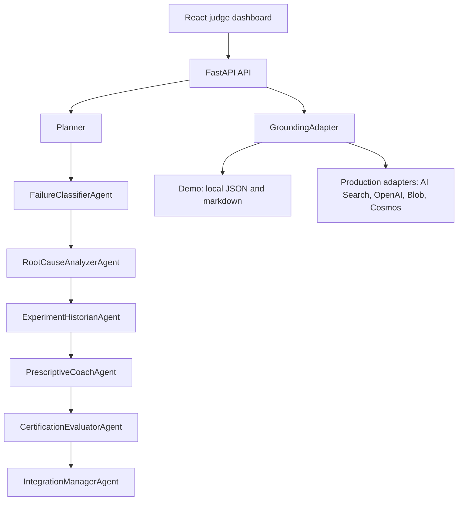

# FailureLens IQ
## Learning Intelligence from Failed ML Experiments

FailureLens IQ turns failed ML experiments into evidence-grounded learning plans using a multi-agent FastAPI backend and React judge demo.

## One-Line Pitch

When an ML experiment fails, FailureLens IQ classifies the failure, explains the root cause, finds similar historical failures, and converts the lesson into a remediation and certification-readiness plan.

## Problem

ML teams often learn from successful model runs but lose the signal inside failed experiments. The result is repeated evaluation mistakes, weak auditability, hidden responsible AI risk, and generic training advice that is not connected to the actual experiment evidence.

## Solution

FailureLens IQ runs a reasoning-agent workflow over experiment metrics, logs, historical failures, local knowledge, and team context. It produces a judge-ready report with:

- Failure classification
- Root-cause analysis
- Historical memory
- Prescriptive remediation
- Microsoft certification alignment
- Manager summary
- Grounded reasoning trace with uncertainty and confidence

## Why Reasoning Agents Are Necessary

A single classifier can label a failed run, but it cannot safely explain why the label matters, compare it with historical failures, decide whether confidence is sufficient, and produce different outputs for engineers, managers, and auditors. FailureLens IQ separates those responsibilities into explicit agents with traceable inputs, outputs, confidence, uncertainty, evidence, and audit entries.

## Microsoft IQ / Azure Foundry Integration

FailureLens IQ runs in demo mode with local grounding by default. Production mode includes Azure adapter boundaries for Azure AI Search, Azure OpenAI, Blob Storage, and Cosmos DB. Real Azure calls are enabled only when credentials are provided.

Current demo behavior:

- Local JSON experiment packets simulate experiment history.
- Local markdown files simulate Microsoft IQ retrieval.
- Grounding references use `source_type: "local_demo_grounding"`.
- `/health` reports Azure integrations as disabled unless credentials are configured.

Adapter boundary:

- `backend/azure/grounding_adapter.py`
- `backend/azure/openai_client.py`
- `backend/azure/ai_search_client.py`
- `backend/azure/blob_client.py`
- `backend/azure/cosmos_client.py`

## Architecture Diagram



## Agent Workflow

1. `FailureClassifierAgent` evaluates deterministic rules and resolves conflicts.
2. `RootCauseAnalyzerAgent` creates the diagnosis using experiment evidence and grounding.
3. `ExperimentHistorianAgent` finds similar historical failures and repeated patterns.
4. `PrescriptiveCoachAgent` produces 3-day and 7-day remediation.
5. `CertificationEvaluatorAgent` maps the gap to Microsoft skill domains and readiness questions.
6. `IntegrationManagerAgent` packages manager insights, grounding, confidence, and audit output.

Planner and ConfidenceGate are orchestration components, not primary judge-facing agents.

## Reasoning Trace Schema

Each reasoning step includes:

```json
{
  "step_number": 1,
  "thought_type": "evidence_check",
  "description": "Checked critical experiment fields.",
  "evidence": [
    {
      "source_type": "experiment_log",
      "source_id": "ClassifierAgent",
      "field_path": "metrics.minority_f1",
      "value": "metrics.minority_f1",
      "interpretation": "Field was reviewed for this reasoning step.",
      "confidence": 0.63
    }
  ],
  "finding": "Minority-class performance is weak.",
  "confidence": 0.63,
  "confidence_delta": 0.08,
  "uncertainty": ["Local demo data is synthetic."],
  "assumptions": ["Experiment fields are accurate enough for this step."],
  "next_action": "Use similar runs as grounding for remediation."
}
```

The app exposes concise, judge-facing reasoning summaries. It does not expose hidden chain-of-thought.

## API Endpoints

- `GET /health`
- `GET /agents`
- `GET /experiments`
- `GET /experiments/{experiment_id}`
- `POST /experiments/upload`
- `POST /demo/run`
- `POST /analysis/run`
- `POST /analysis/run/{experiment_id}`
- `GET /analysis/stream/{experiment_id}`
- `GET /knowledge/search?q=...`
- `GET /manager/team/{team_id}`
- `GET /manager/all`
- `POST /report/{experiment_id}/generate`
- `GET /report/{experiment_id}`

## Frontend Demo

The React app calls the backend API through `frontend/src/api/client.ts`.

If the backend is unavailable, the UI shows:

`Backend disconnected: showing local mock preview.`

The Judge Demo button calls `POST /demo/run` and displays the agent workflow and report summary.

## Local Setup

```powershell
python -m venv .venv
.\.venv\Scripts\activate
pip install -r requirements.txt
uvicorn backend.api.main:app --reload --port 8000
```

In another terminal:

```powershell
cd frontend
npm install
npm run dev
```

Open `http://localhost:5173`.

## Docker Setup

```powershell
docker compose up --build
```

The API is served on `http://localhost:8000` and the frontend on `http://localhost:5173`.

## Azure Production Setup

Copy `.env.example` to `.env` and set `APP_MODE=production`. Azure features are enabled only when the matching credentials exist:

- Azure OpenAI: `AZURE_OPENAI_ENDPOINT`, `AZURE_OPENAI_API_KEY`, `AZURE_OPENAI_DEPLOYMENT`
- Azure AI Search: `AZURE_AI_SEARCH_ENDPOINT`, `AZURE_AI_SEARCH_KEY`, `AZURE_AI_SEARCH_INDEX`
- Azure Blob Storage: `AZURE_STORAGE_CONNECTION_STRING`, `AZURE_BLOB_CONTAINER`
- Azure Cosmos DB: `AZURE_COSMOS_ENDPOINT`, `AZURE_COSMOS_KEY`, `AZURE_COSMOS_DATABASE`, `AZURE_COSMOS_CONTAINER`

If credentials are missing, the adapter returns clear warnings instead of fake Azure results.

## Demo Flow For Judges

```powershell
curl http://localhost:8000/health
curl http://localhost:8000/agents
curl -X POST http://localhost:8000/demo/run
curl -X POST http://localhost:8000/analysis/run/EXP-1001
curl -N http://localhost:8000/analysis/stream/EXP-1001
```

Then open the frontend and click `Judge Demo`.

## Sample Output

`POST /demo/run` returns:

- `demo_title`
- `executive_summary`
- `agent_workflow`
- `failure_classification`
- `root_cause_analysis`
- `historical_memory`
- `remediation_plan`
- `certification_readiness`
- `reasoning_timeline`
- `grounding_summary`
- `confidence_summary`
- `manager_summary`
- `judge_notes`

## Testing

```powershell
pytest tests -v
```

The tests cover health contract, agents endpoint, demo report, reasoning schema, grounding refs, frontend API contract, no committed `.venv`, and docs truthfulness.

## Judging Alignment

FailureLens IQ aligns with the Reasoning Agents track by showing:

- Multi-agent decomposition with clear roles
- Evidence objects and grounding refs
- Confidence and uncertainty at each reasoning step
- Historical memory from failed experiments
- Responsible AI and human-review gating
- Enterprise reporting for engineering managers
- Honest Azure adapter boundary

## Known Limitations

- The bundled demo data is synthetic.
- Demo mode uses local grounding, not live Microsoft IQ or Azure AI Search.
- Azure OpenAI, AI Search, Blob Storage, and Cosmos DB are adapter boundaries unless credentials are configured.
- The frontend is an MVP dashboard, not a full experiment management product.
- Reports are generated as markdown files in `reports/` for local demo use.

## Roadmap

- Persist uploaded experiments.
- Add real Azure AI Search retrieval when credentials are available.
- Store traces in Cosmos DB in production mode.
- Upload artifacts to Azure Blob Storage.
- Add role-based auth and organization workspaces.
- Add MLflow or Azure ML experiment ingestion.
