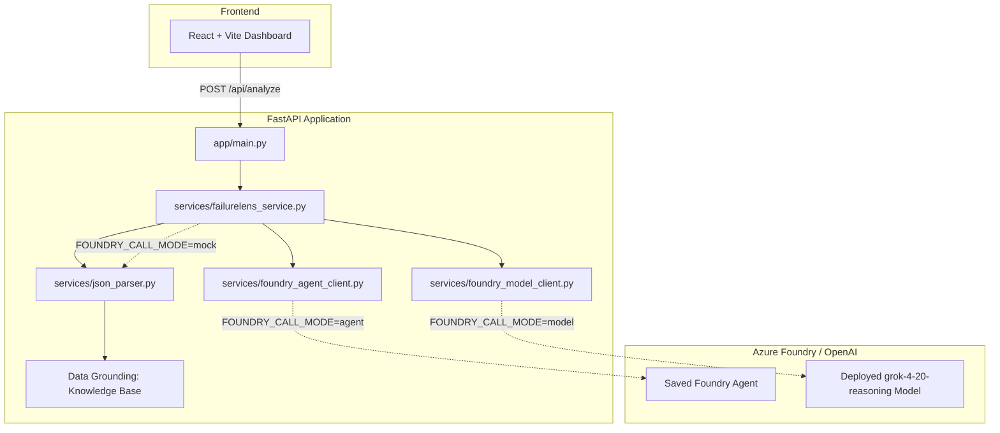

# FailureLens IQ

**Enterprise Reasoning Agent for Diagnosing Failed ML Experiments**

> Built for the [Microsoft Agents League](https://aka.ms/agentsleague) hackathon.

FailureLens IQ is a DEMO-READY MVP WITH AZURE PRODUCTION ADAPTERS. Real Azure calls are enabled only when credentials are provided. It analyzes failed machine learning experiments, identifies root causes, recommends fixes, and maps failures to learning/certification gaps. It is grounded in a curated ML-failure knowledge base and utilizes Microsoft Azure AI Foundry Agents/Models to perform automated experiment diagnosis.

---

## One-Line Pitch

When an ML experiment fails, FailureLens IQ classifies the failure, explains the root cause, finds similar historical failures, and converts the lesson into a remediation and Microsoft certification-readiness plan.

## Microsoft Foundry IQ Integration

FailureLens IQ uses Microsoft Foundry IQ as its intelligence layer for knowledge grounding, certification mapping, and reasoning support.

* **Local Mode** (default): TF-IDF knowledge retrieval over Microsoft certification skill guides. Zero Azure dependencies. Full reasoning pipeline runs locally.
* **Azure Mode**: Azure AI Search + Azure AI Foundry for enterprise semantic search, vector retrieval, and production grounding.

Direct OpenAI can be enabled as fallback reasoning with `MODEL_PROVIDER=openai`, but OpenAI direct API does not replace Microsoft IQ.

---

## Architecture



---

## Environment Setup & Installation

### 1. Backend Setup

```bash
# 1. Create a virtual environment
python -m venv .venv

# 2. Activate virtual environment
# On Windows (PowerShell):
.venv\Scripts\activate
# On macOS / Linux:
source .venv/bin/activate

# 3. Install dependencies
pip install -r backend/requirements.txt

# 4. Copy backend environment template
cp backend/.env.example backend/.env
```

### 2. Running the Backend

Run the FastAPI backend with:

```bash
uvicorn app.main:app --reload --app-dir backend
```

Once running, you can access the interactive API docs at `http://localhost:8000/docs`.

### 3. Frontend Setup

In a new terminal:

```bash
cd frontend
npm install
npm run dev
```

---

## Switching Call Modes

FailureLens IQ supports three execution modes controlled by the `FOUNDRY_CALL_MODE` environment variable in your `.env` file:

### 1. Mock Mode (`FOUNDRY_CALL_MODE=mock`)
* **Purpose**: Run the entire system locally without requiring any active Azure subscription or API keys.
* **How it works**: Returns high-quality, realistic synthetic diagnoses matching the input experiment profile (e.g., overfitting, leakage, imbalance, underfitting).
* **Setup**: This is the default mode. No credentials required.

### 2. Agent Mode (`FOUNDRY_CALL_MODE=agent`)
* **Purpose**: Execute diagnosis using a saved Microsoft Azure AI Foundry Agent.
* **How it works**: Connects to the agent using the Azure AI Projects SDK.
* **Required variables**:
  ```env
  AZURE_AI_PROJECT_ENDPOINT=your_project_endpoint_connection_string
  AZURE_AI_AGENT_NAME=FailureLensIQAgent
  AZURE_AUTH_MODE=api_key # or aad
  AZURE_AI_API_KEY=your_azure_api_key
  ```

### 3. Model Mode (`FOUNDRY_CALL_MODE=model`)
* **Purpose**: Query the deployed model directly using the OpenAI-compatible client pattern.
* **How it works**: Sends a structured system prompt and experiment data to the model.
* **Required variables**:
  ```env
  AZURE_AI_PROJECT_ENDPOINT=your_project_endpoint_connection_string
  AZURE_AI_API_KEY=your_azure_api_key
  AZURE_AI_MODEL_DEPLOYMENT_NAME=grok-4-20-reasoning
  ```

---

## Security

* **Never commit `.env` or `.env.local`**. These are added to `.gitignore`.
* **Private Key & Secret Protection**: `*.key`, `*secrets*`, and `secrets/` folders are ignored by git.
* **API Log Masking**: API keys and connection strings are parsed securely and never printed to console logs.

---

## API Documentation

### GET `/health`
Returns the status of the API, the current active mode, and whether Azure credentials have been configured.

**Sample Response**:
```json
{
  "status": "ok",
  "service": "FailureLens IQ API",
  "foundry_mode": "mock",
  "credentials_configured": false
}
```

### POST `/api/analyze`
Core endpoint for analyzing a failed machine learning experiment.

**Request Payload**:
```json
{
  "experiment": {
    "experiment_id": "rf-overfit-001",
    "model": "RandomForestClassifier",
    "train_accuracy": 0.97,
    "validation_accuracy": 0.61,
    "test_accuracy": 0.59,
    "dataset_size": 2000,
    "feature_count": 120,
    "notes": "No cross-validation, no feature selection, default hyperparameters."
  }
}
```

**Response Schema**:
Matches the `FailureAnalysisResponse` model. See `backend/data/golden_outputs/overfitting_random_forest_output.json` for a full response example.

---

## Microsoft IQ & Knowledge Base Files

Grounding data and enterprise knowledge are structured inside `backend/data/knowledge/`:

1. **`ml_failure_patterns.md`**: Outlines common metrics, symptoms, and indicators for Overfitting, Underfitting, Data Leakage, Class Imbalance, Metric Mismatch, Non-Representative Splits, Feature Drift, and Label Noise.
2. **`certification_rubric.md`**: Maps each failure category to specific Microsoft certification paths (e.g. DP-100, AI-102, DP-203, PL-300) and learning paths.
3. **`enterprise_ml_playbook.md`**: Standard Operating Procedures (SOP) containing immediate fix protocols, validation requirements, and production risk evaluation.

---

## Demo Flow for Hackathon Judges

1. **Start Backend & Frontend** in mock mode (verify `/health` is reporting `foundry_mode: mock`).
2. **Open Dashboard** at `http://localhost:5173`.
3. **Select Overfitting Sample** from the sample selector and click **Analyse Experiment**.
4. **Walk through the Diagnosis**:
   * Review the train-test accuracy gap.
   * Explain the step-by-step **Reasoning Trace** displaying factual observations and interpretations.
   * Review the **Recommended Fixes** and the structured **Next Experiment Plan**.
   * Show the **Certification Gap** mapping.
5. **Demonstrate Code Extensibility**: Show the judge how the exact same request will flow to the saved Azure Foundry Agent or model by simply updating `.env` to `FOUNDRY_CALL_MODE=agent` or `FOUNDRY_CALL_MODE=model`.

---

## Documentation

For detailed guides, policies, and architectures, refer to the following project documents:
* **Production Deployment**: [Production Hardening](docs/PRODUCTION_HARDENING.md)
* **Security & Auth**: [Security Model](docs/SECURITY_MODEL.md)
* **Foundry IQ Alignment**: [Microsoft IQ Honest Compliance](docs/MICROSOFT_IQ_HONEST_COMPLIANCE.md)
