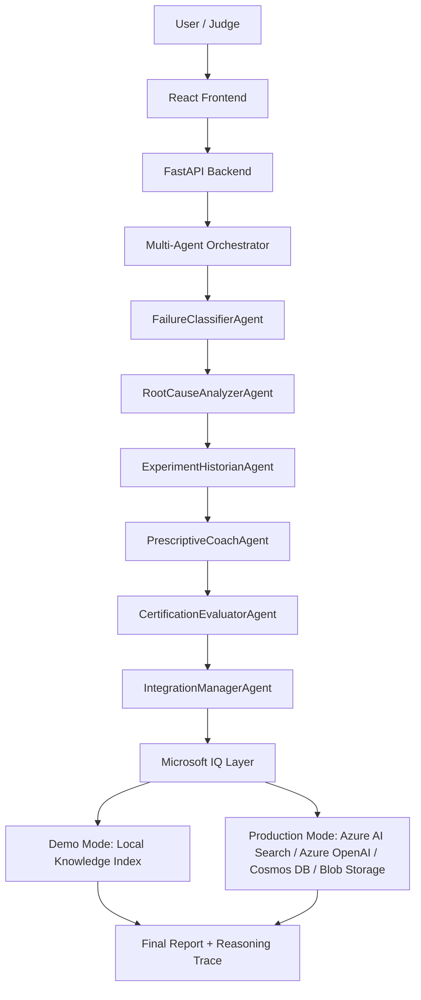

# FailureLens IQ Architecture Diagram

```mermaid
flowchart TD
    A["User / Judge"] --> B["React Frontend"]
    B --> C["FastAPI Backend"]
    C --> D["Multi-Agent Orchestrator"]
    D --> E["FailureClassifierAgent"]
    E --> F["RootCauseAnalyzerAgent"]
    F --> G["ExperimentHistorianAgent"]
    G --> H["PrescriptiveCoachAgent"]
    H --> I["CertificationEvaluatorAgent"]
    I --> J["IntegrationManagerAgent"]
    J --> K["Microsoft IQ Layer"]
    K --> L["Demo Mode: Local Knowledge Index"]
    K --> M["Production Mode: Azure AI Search / Azure OpenAI / Cosmos DB / Blob Storage"]
    L --> N["Final Report + Reasoning Trace"]
    M --> N
```
