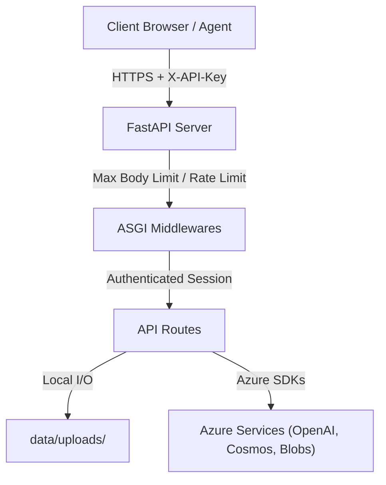

# Security Model

This document outlines the security architecture and threat mitigation strategies implemented in FailureLens IQ.

## Architecture & Threat Boundaries

## Security Controls

### 1. Authentication & Authorization
- **Mechanism:** API Key authentication enforced using the HTTP Header `X-API-Key`.
- **Scope:** Protected mutating and sensitive endpoints:
  - `POST /experiments/upload`
  - `POST /analysis/custom`
  - `POST /analysis/run`
  - `POST /analysis/run/{experiment_id}`
  - `POST /demo/run`
  - `POST /report/{experiment_id}/generate`
  - `GET /report/{experiment_id}`
  - `GET /manager/all`
- **Configuration:** Controlled by the `ENABLE_AUTH` (default `false`) and `API_KEY` environment variables.

### 2. CORS (Cross-Origin Resource Sharing)
- Enforced dynamically using the `CORS_ORIGINS` environment variable.
- In `production` mode, if `CORS_CREDENTIALS` is enabled, the wildcard origin (`*`) is explicitly rejected. The server will fail startup with a `ValueError` if this insecure configuration is detected.

### 3. Denial of Service (DoS) Protections
- **Payload Size Capping:** `MaxBodySizeMiddleware` intercepts incoming requests and rejects payloads larger than `MAX_UPLOAD_BYTES` (default 1MB) with `413 Payload Too Large`.
- **Rate Limiting:** Enforced via `RateLimitMiddleware`, tracking request counts per path group per IP. Defaults to 60 requests per minute per route. Exempts health and agents endpoints to maintain monitoring access.
- **Pydantic Validation Caps:** Added `Field(max_length=...)` limits on string properties in the Pydantic data schemas to prevent oversized payloads from triggering excessive CPU processing or memory bloat.

### 4. Security Response Headers
The `SecurityHeadersMiddleware` appends defensive HTTP headers to all outbound responses:
- `X-Content-Type-Options: nosniff` (prevents MIME type sniffing)
- `X-Frame-Options: DENY` (mitigates clickjacking)
- `Referrer-Policy: no-referrer` (prevents leaking referrer data)
- `Cache-Control: no-store` (default for all API responses to prevent local caching of sensitive experiment details)
- `Content-Security-Policy` (limits scripts, styles, and image sources to prevent XSS)

### 5. Error Handling & Secret Exposure Prevention
- Global exception handlers intercept unhandled application exceptions, logging the detailed stack trace to secure server outputs while returning a sanitized `500 Internal Server Error` message to the client. This prevents leaking database structures, source files, or internal connection strings to attackers.
