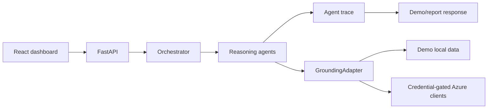

# Architecture

FailureLens IQ is a FastAPI plus React MVP with a deterministic multi-agent backend and local demo grounding.

## Components

- `backend/api/main.py`: FastAPI app and endpoint contracts.
- `backend/core/orchestrator.py`: Agent orchestration and SSE event emission.
- `backend/agents/`: Reasoning agents and trace generation.
- `backend/azure/`: Credential-gated Azure adapter boundary.
- `backend/services/`: local knowledge index, scoring, reporting.
- `frontend/src/api/client.ts`: React API client.
- `frontend/src/hooks/useSSEStream.ts`: EventSource streaming hook.
- `data/`: synthetic experiment and team data.
- `knowledge/`: local markdown grounding corpus.

## Data Flow

## Modes

Demo mode is default and works without credentials. Production mode can enable Azure adapters when credentials are present. Missing credentials return warnings rather than fake Azure data.
